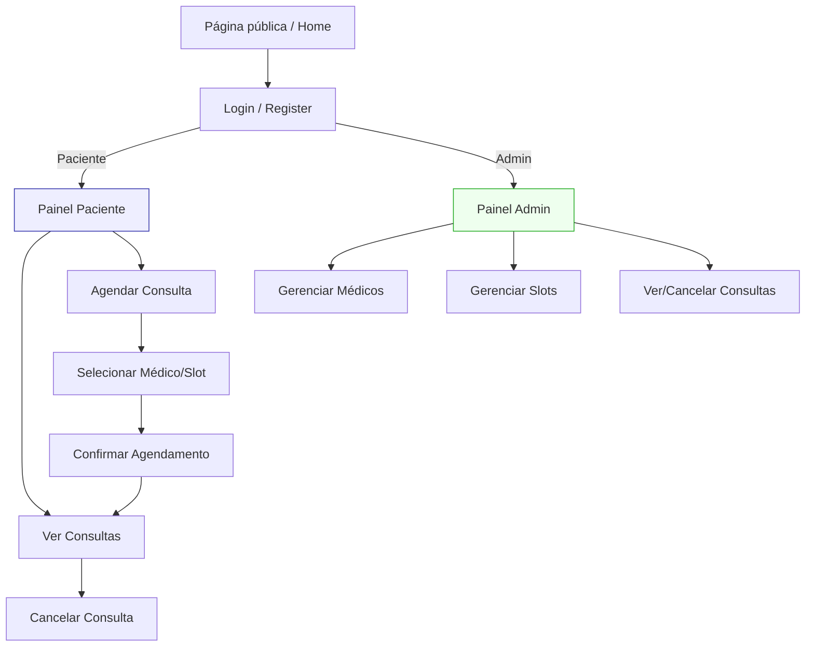

# Front-end Web

Esta é a interface principal do sistema de gerenciamento da clínica, responsável por fornecer a experiência do usuário para pacientes, profissionais de saúde e administradores. A aplicação web consome a API REST desenvolvida no back-end para apresentar e gerenciar os dados de forma intuitiva, ágil e responsiva.

O objetivo deste front-end é traduzir as regras de negócio complexas do sistema em fluxos de navegação simples, permitindo que cada perfil de usuário realize suas tarefas de forma eficiente.

#### Objetivos específicos do Front-end:

Para Pacientes: Criar um portal público onde possam pesquisar especialidades e profissionais, visualizar agendas em tempo real, realizar agendamentos, remarcações, cancelamentos e acessar seu histórico de consultas.

Para Profissionais de Saúde: Desenvolver um painel de controle (dashboard) logado que permita ao profissional gerenciar sua própria agenda, definir bloqueios/férias e acessar os prontuários eletrônicos de seus pacientes.

Para Administradores: Implementar uma área administrativa robusta para o gerenciamento completo de profissionais, pacientes, especialidades e convênios, além da supervisão geral dos agendamentos.

## Projeto da Interface Web

[Descreva o projeto da interface Web da aplicação, incluindo o design visual, layout das páginas, interações do usuário e outros aspectos relevantes.]

### Wireframes

[Inclua os wireframes das páginas principais da interface, mostrando a disposição dos elementos na página.]

## Home

### Home - Desktop

### Home - Tablet

### Home - Mobile

## Cadastro

### Cadastro - Desktop

### Cadastro - Tablet

### Cadastro - Mobile

## Login

### Login - Desktop

### Login - Tablet

### Login - Mobile

### Design Visual

### Paleta de cores:

A paleta de cores do Medlink foi escolhida para transmitir profissionalismo, clareza e confiança, com foco em saúde e bem-estar do paciente. 

#### Cores principais:

A cor verde (#16A34A), cor principal, é tradicionalmente associado a saúde. Foi utilizada em botões principais, elementos de destaque e avisos de sucesso.   
A cor branca (#FFFFFF) foi escolhida pois transmite limpeza, simplicidade e neutralidade, garantindo que os elementos coloridos se destaquem. Foi utilizada no projeto como fundo das seções, cards e inputs para facilitar uma leitura clara e agradável.  
A cor cinza escuro(#6B7280) tem a função de ser uma cor neutra para textos, descrições e subtítulos, garantindo legibilidade. Além disso, mantém harmonia com o branco e o verde.  
A cor cinza claro (#E5E7EB) foi utilizada para borda de cards, inputs, seções e divisores, proporcionando delimitação sutil de elementos da página. A escolha da cor também contribui para um layout limpo e organizado.  
A cor azul (#E0F2FE) transmite tranquilidade, limpeza e suavidade, mantendo a interface leve e agradável. Foi escolhida, portanto, para o fundo da página web.  

 
#### Cores de alerta:

A cor verde (#16A34A), além de ser a cor principal da interface e normalmente associada à saúde, também é usada no contexto para indicar sucesso ou confirmação em mensagens de confirmação e seleção ativa.   
A cor vermelha (#EF4444) é usada para alertas, erros ou campos inválidos.
  

### Tipografia:

A tipografia do sistema Medlink foi definido para garantir uma leitura clara e compatibilidade entre diferentes dispositivos e sistemas operacionais. Além disso, as fontes possuem diferentes pesos e tamanhos, o que ajuda os usuários a identificar diferentes seções e informações importantes rapidamente. Todas as páginas principais utilizam fontes padronizadas, que são:

Inter:  

Roboto:  

Helvetica Neue:  

Arial:  

### Utilização de emojs e ícones:

O painel inicial do Medlink utiliza uma combinação de ícones gráficos e emojis para tornar a navegação intuitiva para o usuário e reforçar visualmente as funcionalidades principais. Eles seguem a paleta de cores da interface e ajudam o usuário a identificar rapidamente cada seção. Abaixo, um exemplo de utilização de emojis no projeto:

Outro exemplo interessante é o uso de emojis para facilitar a localização da informação na tela sobre onde o atendimento ocorrerá. Além disso, o símbolo de check verde indica visualmente que aquele médico foi escolhido. Isso ajuda a criar feedback imediato para o usuário, aumentando a clareza da interação. Esses exemplos podem ser vistos abaixo:

  
De forma geral, foram utilizados ícones SVGs que facilitam a navegação, para que fique mais fluido para o usuário. É importante ressaltar que todos os ícones seguem a paleta de cores, mantendo coerência visual.

## Fluxo de Dados

# User flow — MedLink

## Visão geral
MedLink é uma aplicação de agendamento e gerenciamento de consultas médicas com duas personas principais: Paciente e Admin (clínica/recepção). Este documento descreve os fluxos principais de uso, pontos de entrada, telas envolvidas, referências ao código (para desenvolvedores) e fluxos alternativos.

---

## Todo (o que foi feito)
- [x] Levantar contexto do projeto — identificar páginas, componentes e hooks relevantes.
- [x] Escrever resumo do user flow em Markdown (português).
- [x] Gerar diagrama Mermaid e alternativa textual.
- [x] Revisar e entregar Markdown final.

---

## Personas
- Paciente: registra-se, autentica-se, visualiza/agendar/cancelar consultas.
- Admin (Recepção/Gestor): gerencia médicos, slots (horários), visualiza e cancela consultas, administra o sistema.

---

## Pontos de entrada (arquivos relevantes)
- Página pública (Home): `src/app/home/home-page.tsx`, `src/app/page.tsx`  
- Login: `src/app/login/page.tsx`  
- Registro: `src/app/register/page.tsx`  
- Área do Paciente (consultas): `src/app/paciente/consultas/page.tsx`  
- Área Admin: `src/app/admin/layout.tsx`, `src/app/admin/page.tsx`  
- Serviços/API: `src/app/services/api.ts`, `src/app/services/auth.ts`  
- Contexto de autenticação: `src/app/contexts/auth-context.tsx`  
- Hooks e features: `src/features/*`, `src/hooks/*`  
- Validações: `src/app/validators/tasks-validators.ts`  
- Notificações/UI: `src/app/components/ui/toast.tsx`

---

## Fluxos principais

### 1) Registro e autenticação (Paciente)
- Entrada: Home → `Entrar` / `Registrar` (`/login`, `/register`).
- Formulário de registro: `src/app/register/page.tsx` chama `src/app/services/auth.ts`.
- Ao criar conta com sucesso:
  - Recebe token/sessão → armazenado via `auth-context.tsx` / `services/auth.ts`.
  - Redireciona para `/paciente/consultas`.
- Login: `src/app/login/page.tsx` → `services/auth.ts` → `auth-context.tsx`.

Fluxos alternativos / erros:
- Validação de campos via `src/app/validators/tasks-validators.ts`.
- Erro do servidor: exibir `toast` (`src/app/components/ui/toast.tsx`).

---

### 2) Visualizar disponibilidade e agendar consulta (Paciente)
- Painel: `src/app/paciente/consultas/page.tsx`.
- Usuário clica “Agendar” → formulário (por exemplo `src/app/paciente/consultas/nova`).
- Seleciona médico/slot → dados vindos de hooks/queries (`src/features/paciente/queries.ts`, `src/hooks/useCreateSlots.ts`).
- Submete → `src/app/services/api.ts` → backend.
- Sucesso → refetch da lista de consultas e notificação (toast).

Fluxos alternativos:
- Slot ocupado no submit → mostrar conflito e sugerir horários.
- Usuário não autenticado → redirecionar para login.

---

### 3) Cancelar consulta (Paciente)
- Lista de consultas (`/paciente/consultas`) → ação “Cancelar”.
- Confirmação → chamada para `useCancelarConsulta.ts` (ou `src/features/paciente/useCancelarConsulta.ts`).
- Backend processa → lista atualizada, notificação exibida.

Regras de negócio comuns:
- Cancelamentos com antecedência mínima (configuração backend).
- Histórico mantido para auditoria.

---

### 4) Administração (Admin)
- Login admin (pode ser via mesma rota de login, com role checada).
- Painel admin: `src/app/admin/layout.tsx` → navegação para:
  - `admin/consultas` — listar/filtrar/cancelar consultas.
  - `admin/medicos` — criar/editar médicos (`src/hooks/useCreateMedico.ts`).
  - `admin/slots` — criar/remover slots (`src/hooks/useCreateSlots.ts`, `src/hooks/useAdminSlots.ts`).
- Ações administrativas usam hooks/features: `src/features/admin/useAdminConsultas.ts`, `src/hooks/useAdminSlots.ts`.

Permissões:
- Autorizações verificadas via `auth-context.tsx` e hooks como `useAdminAuth.ts`.
- Acesso negado → redirecionamento / página de erro.

---

## Mapeamento Tela ↔ Componentes / Hooks / Serviços
- Autenticação
  - Front: `src/app/login/page.tsx`, `src/app/register/page.tsx`
  - Contexto: `src/app/contexts/auth-context.tsx`
  - Serviço: `src/app/services/auth.ts`
- Painel Paciente
  - Tela: `src/app/paciente/consultas/page.tsx`
  - Hooks/queries: `src/features/paciente/queries.ts`, `src/features/paciente/useAgendarConsulta.ts`
  - UI: componentes em `src/app/components/*`
- Painel Admin
  - Layout/telas: `src/app/admin/layout.tsx`, `src/app/admin/consultas/page.tsx`, `src/app/admin/medicos/page.tsx`, `src/app/admin/slots/page.tsx`
  - Hooks: `src/features/admin/useAdminConsultas.ts`, `src/hooks/useAdminSlots.ts`, `src/hooks/useCreateMedico.ts`, `src/hooks/useCreateSlots.ts`
- Notificações: `src/app/components/ui/toast.tsx`
- API central: `src/app/services/api.ts`

---

## Diagrama (Mermaid) 

## Tecnologias Utilizadas

| Categoria | Tecnologia(s) |
| :--- | :--- |
| Linguagens Base | HTML5, CSS3, JavaScript (ES6+) |
| Linguagem de Tipagem | TypeScript |
| Framework/Biblioteca UI | React.js |
| Gerenciador de Estado | Redux Toolkit |
| Framework de Estilização | Material-UI ou Tailwind CSS |
| Cliente HTTP | Axios |

## Considerações de Segurança

[Discuta as considerações de segurança relevantes para a aplicação distribuída, como autenticação, autorização, proteção contra ataques, etc.]

## 🚀 Implantação (Deploy)

A aplicação **front-end web** será implantada na **Amazon Web Services (AWS)**, garantindo escalabilidade, segurança e alta disponibilidade.

### Arquitetura de Deploy (Front-End Web)

A estratégia de implantação mais provável para um projeto React/web estático na AWS envolve:

1.  **Amazon S3 (Simple Storage Service):**
    * O *build* de produção do projeto (os arquivos estáticos `HTML`, `CSS` e `JavaScript` gerados) será armazenado em um bucket S3.
    * Este bucket será configurado para atuar como um servidor de *static website hosting*.

2.  **Amazon CloudFront:**
    * Uma distribuição do CloudFront (um serviço de CDN - Content Delivery Network) será configurada na frente do bucket S3.
    * **Benefícios:** Isso garante que a aplicação seja carregada rapidamente para usuários em qualquer lugar do mundo, além de fornecer uma camada de segurança (DDoS) e permitir a fácil configuração de um certificado **SSL/TLS (HTTPS)**.

*Alternativa: Também está em consideração o uso do **AWS Amplify**, que automatiza todo esse processo (build, deploy e hospedagem) diretamente a partir do repositório Git.*

### Status do Projeto

Esta etapa de implantação refere-se exclusivamente à **aplicação Web**.

O desenvolvimento da aplicação **Mobile** (com React Native) é uma fase futura do projeto. Quando concluído, o mobile terá seu próprio ciclo de vida e processo de implantação (publicação na Google Play Store e Apple App Store).

## Testes

RF-001 : Permitir login e autenticação de pacientes e profissionais de saúde:

RF-002 – Permitir atualização de dados pessoais e contato dos usuários
Cadastrar e atualizar Médico.

RF-003 - Permitir que pacientes visualizem a disponibilidade de profissionais por especialidade

RF-004 - Permitir agendamento de consultas e exames de acordo com horários disponíveis

RF-005 - Evitar conflitos de horário ao impedir marcações duplicadas ou sobreposição de agendas
Como já havia marcado as 08:00 esse horário some.

RF-016- Gerar relatórios básicos (ex.: consultas por período/profissional/status; taxa de faltas)  
Profissionais cadastrados

Relatório de consultas agendada por paciente

RNF-001- A interface deve ser intuitiva para diferentes tipos de usuários (pacientes e profissionais de saúde) 
Itens observados: uma paleta de cores harmônica, bom uso de contrastes, botões de fácil localização e uma interface intuitiva e amigável.

RNF-002 - A navegação deve ser simples, com menus claros e informações visíveis  
Itens observados: páginas com botões visíveis e intuitivos, design limpo.

 
Avisos claros, com cores adequadas para indicar sucesso ou falha: 

RNF-003 - Permitir acesso ao sistema via navegador web e aplicativo mobile  
Navegador web:

A versão mobile será implementada na próxima etapa.

RNF-004	Atualização em tempo real das agendas de profissionais

# Referências

Inclua todas as referências (livros, artigos, sites, etc) utilizados no desenvolvimento do trabalho.

# Planejamento

##  Quadro de tarefas

> Apresente a divisão de tarefas entre os membros do grupo e o acompanhamento da execução, conforme o exemplo abaixo.

### Etapa 3

Atualizado em: 31/10/2025

| Responsável   | Tarefa/Requisito | Iniciado em    | Prazo      | Status | Terminado em    |
| :----         |    :----         |      :----:    | :----:     | :----: | :----:          |
| Beatriz     | Documentação - Design Visual | 29/10/2025     | 02/11/2025 | ✔️    | 31/10/2025      |
| Beatriz     | Testes    | 29/10/2025     | 02/11/2025 | ✔️    |        02/11/2025         |
| Ramir   | Documentação - Considerações de Segurança | 29/10/2025     | 02/11/2025 | ✔️    | 02/11/2025      |
| Ramir   | Testes    | 29/10/2025     | 02/11/2025 | ✔️    |    02/11/2025            |

Legenda:
- ✔️: terminado
- 📝: em execução
- ⌛: atrasado
- ❌: não iniciado

